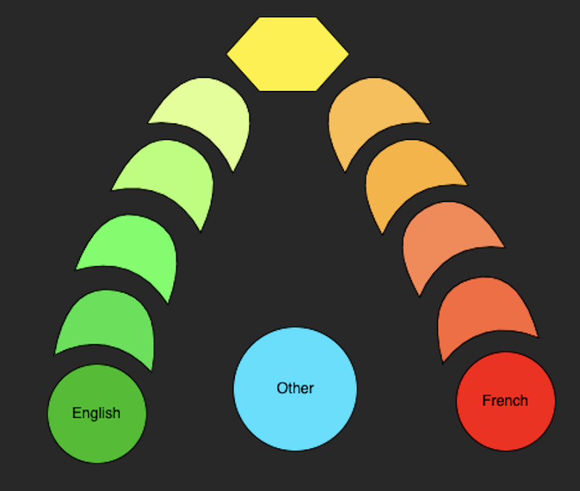

# Functional Specification

- [1. Introduction](#1-introduction)
  - [Team](#team)
- [2. Definitions of terms](#2-definitions-of-terms)
- [3. In-depth](#3-in-depth)
- [4. Data collection](#4-data-collection)
- [5. Privacy and confidentiality](#5-privacy-and-confidentiality)
  - [Privacy](#privacy)
  - [Confidentiality](#confidentiality)
- [6. Use cases](#6-use-cases)

---

## 1. Introduction

The goal of this project is to create a device. It would listen to conversations and detect whether the language is English or French. The students will not interact with the device.

A color will be emitted following the language spoken (green for good English, red for French, and blue for other languages).

We have 9 weeks to complete this project, from April 25th to June 24th, 2022.

### Team

The team will be composed of:

- Clémentine CUREL as Project Manager
- Louis DE LAVENNE DE CHOULOT DE CHABAUD-LA-TOUR as Tech Leader
- Max BERNARD
- Léo CHARTIER
- Thomas PLANCHARD
- Quentin CLEMENT

 
## 2. Definitions of terms

| Terms                        | Definition                                                                                                                                                                                                                                                                                                                                           |
| ---------------------------- | ---------------------------------------------------------------------------------------------------------------------------------------------------------------------------------------------------------------------------------------------------------------------------------------------------------------------------------------------------- |
| Artificial intelligence (AI) | Ability of a computer or a robot controlled by a computer to do tasks that are usually done by humans because they require human intelligence and discernment.                                                                                                                                                                                       |
| Deep Learning                | Concept of computers simulating the process a human brain takes to analyze, think and learn. The deep learning process involves something called a Neural Network as a part of the thinking process for an AI. It takes an enormous amount of data to train Deep Learning and a considerably powerful computing device for such computation methods. |
| Hardware                     | Physical and electronic parts of a computer or other piece of equipment, opposite to the software which corresponds to the programs and instructions that run on the computer.                                                                                                                                                                       |
| Machine learning             | Subfield of artificial intelligence, which is broadly defined as the capability of a machine to imitate intelligent human behavior. Artificial intelligence systems are used to perform complex tasks in a way that is similar to how humans solve problems. Machine learning is one way to use AI.                                                  |

 
## 3. In-depth

To go in-depth on this project, this software have to be an Artificial Intelligence using Deep Learning.
The AI should be trained to recognize which language people are talking in. After this, to go further you can show how much the AI have recognise. 

As result, the device should be provided with a light that would change colour depending on the spoken language:
- Red when speaking French.
- Green when speaking English.

And to go further, you can use more colors of the light:
| Color       | Reason                                         |
| ----------- | ---------------------------------------------- |
| Light green | The AI have recognise more English than French |
| Orange      | The AI have recognise more French than English |
| Yellow      | The AI can't decide between French and English |
| Blue        | Other language or unrecognized language        |

The color gradient would depend on the accents as represented in this picture:

 
## 4. Data collection

One of the crucial points of this project is the training of the AI. To do so, a lot of data (voice recording) is needed.
There are two ways to get such data:

The first way is to record the people in our building by placing microphones in the rooms. The advantage of this method is that the data is more consistent with one of the use cases for the device.
On the other hand, there are many disadvantages like the reliability of the data. We would need to listen to all the recordings to make sure the subjects are speaking French when we need it and English when we need it.

The second way is to use data from the internet with a bank of data. The advantage is the number of data that we can have very quickly. Moreover, there are no real disadvantages.

 
## 5. Privacy and confidentiality

This device will listen to all the conversations around it, so we want to be sure that the conversations are not recorded or used for something else than the detecting language.

### Privacy

To use this kind of device, all the people that are being monitored must know that the device is on. 
If you put this device in a project room or working room, something similar to a signage must be put in the room. 

### Confidentiality

We think that it is not necessary to keep records of the languages that were used since it would bring up confidentiality problems and may cause a breach of data to occur.

To prevent the possibility of accessing the data, the device will not be connected to the internet. It will also make the device difficult to hack since it would involve a physical contact with the hardware.

The encryption of some information may be required to ensure security and confidentiality.

 
## 6. Use case

This device could be used worldwide in schools to make sure students speak English in English classes and not in their native language.
An example would be, at ALGOSUP, an all-English, French school of computer science, if a student were to speak French during project time, the police would be alerted and would take them into custody.

