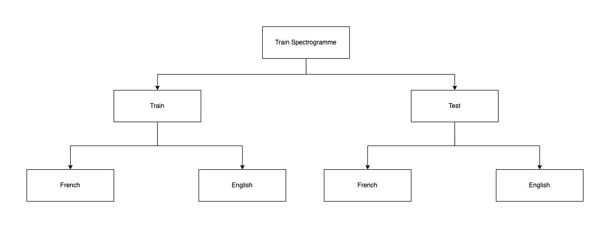
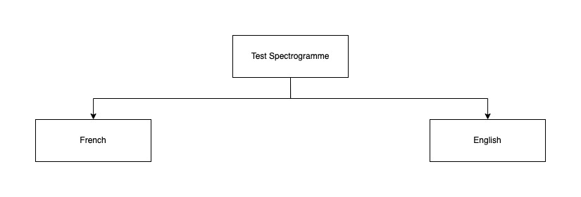
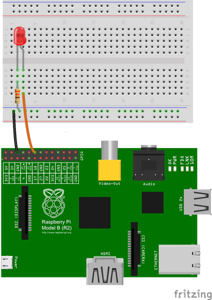
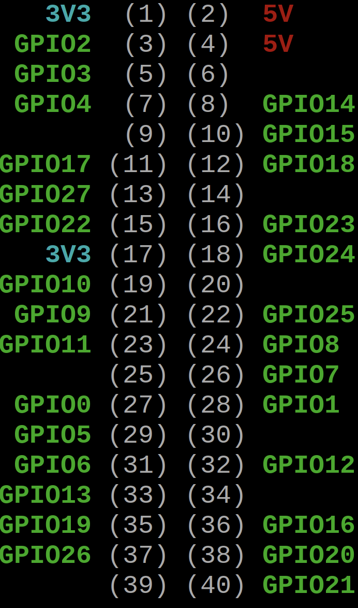

# Technical Specification #

---

- [Technical Specification](#technical-specification)
  - [1. Introduction](#1-introduction)
    - [a. Overview](#a-overview)
    - [b. Glossary of Terminology](#b-glossary-of-terminology)
    - [c. Context](#c-context)
    - [d. Goal](#d-goal)
    - [e. Out of Scope](#e-out-of-scope)
  - [2. Solutions](#2-solutions)
    - [a. Existing Solutions](#a-existing-solutions)
    - [b. Suggested Solution](#b-suggested-solution)
    - [c. Retained Solutions](#c-retained-solutions)
  - [3. Further Considerations](#3-further-considerations)
    - [a. Security and privacy](#a-security-and-privacy)
    - [b. Risks](#b-risks)
  - [4. Impact of the project](#4-impact-of-the-project)
  - [5. Work](#5-work)
    - [a. Work estimates and timelines](#a-work-estimates-and-timelines)
    - [b. Milestones](#b-milestones)
      - [Creation of a dataset](#creation-of-a-dataset)
      - [Accessing the datasets](#accessing-the-datasets)
      - [Evaluation generator](#evaluation-generator)
      - [Creation of a model](#creation-of-a-model)
      - [Train the model](#train-the-model)
      - [Conversion in TensorflowLite and save](#conversion-in-tensorflowlite-and-save)
      - [Initialisation of the Raspberry Pi](#initialisation-of-the-raspberry-pi)
      - [Connecting the LEDs](#connecting-the-leds)
      - [Connect the AI with LEDs with python](#connect-the-ai-with-leds-with-python)
  - [6. End Matter](#6-end-matter)
    - [a. References](#a-references)
    - [b. Acknowledgments](#b-acknowledgments)
  
---

<br>

## 1. Introduction

### a. Overview

This product has to detect the language of a conversation, either English or French.
When a language is detected, an LED will be lit with a color matching the language.

### b. Glossary of Terminology

|                              |                                                                                            |
| ---------------------------- | ------------------------------------------------------------------------------------------ |
| Arduino                      | Microcontroller board that is used to control the electronics in the product.              |
| Artificial Intelligence (AI) | Process of using data to learn patterns and predict future behavior.                       |
| CSV                          | Comma-separated values: Type of file where the data are separated by a comma.              |
| Deep Learning                | Machine Learning concept to simulate the human way of learning using a big amount of data. |
| Greyscale                    | Image type in which only the intensity information is stored, not the colors.              |
| Image                        | Two-dimensional object that is typically displayed on a computer monitor.                  |
| Kaggle                       | Website that allows us to download datasets from the internet and use an online GPU.       |
| Language detection           | Process of detecting the language of a conversation.                                       |
| Machine Learning (ML)        | Process of using data to learn patterns and predict future behavior.                       |
| Neural Network (NN)          | Series of linked neurons similarly to a human brain.                                       |
| Numpy                        | Python library adding support for multi-dimensional arrays, and mathematical functions.    |
| Pandas                       | Python library used for data analysis, including CSV file manipulation.                    |
| Raspberry Pi                 | Microcontroller more performant than the Arduino.                                          |
| Tensorflow                   | Machine learning library that is used to train a model.                                    |

### c. Context

The client is the director of a Computer Science school based in France.
The particularity of this school is that everything is in English with students from all over the world.
As such, most of the conversations are not in English when outside of the classes.

This is why the client requested a language detection system, to force the students to speak English.

### d. Goal

Our client wants a device able to detect the language of a conversation between English and French using an AI.
An accent recognition system will be implemented.

This program should make use of Tensorflow and run on light hardware, as required by the client.

### e. Out of Scope

For the future, we have been thinking about how to improve the device, we want to add more languages like Spanish, Arabic, etc.
We also want to add a voice assistant to correct English mistakes made by users and to give them a better experience.

<br>

## 2. Solutions

### a. Existing Solutions

Many AIs can detect the language of a conversation between English and French.
If we take, for example, Siri, Alexa, or Google Traduction/home, they can detect the language spoken by the user.
The big difference between many of them and our AI is that they can only detect the language if the user previously configured the device with his voice.

### b. Suggested Solution

We initially wanted to have our AI on an Arduino Nano BLE but for the same price, we were able to acquire hardware better fitting the project, the raspberry pi 4.

We don't use Google Collab's GPUs to train our model because they are of the older model `Tesla P80`.
We can't let training run overnight.
The size of our google drive limits our dataset size.

We could pre-process data as they are loaded, using CSV and Pandas.
But this makes it hard to work with Keras DataGenerator.

### c. Retained Solutions

We decided to use a more powerful Raspberry Pi 4.
We will record sound over a 10s period, then convert this stream of data to an image using a MEL spectrogram.
Finally, the AI would take the image as an input and output a probability of it being English or French.

We use Tensorflow and Keras python library to train and run our model.
These are popular libraries that we are taught in class.

We train our model with Kaggle so that we can use GPUs of the newest model `Tesla P100` and unlimited size Dataset.

To process and load the images, we will make the conversion using a `Multiprocess.Pool` to go faster, and once they are processed, we upload the image to a Kaggle dataset.
We will use Keras DataGenerator FlowFromDirectory to load all the images before training.

<br>

## 3. Further Considerations

### a. Security and privacy

The device will not be connected to the Internet to do the recognition, it will be independent.
The conversation data will be used for language recognition and never be stored.
The main goal is to protect the device and the user from potential hacks or data leaks.

### b. Risks

For this kind of project, we have multiple risks, especially around audios.

**Noises with voices**

Having noises in a voice recording can prevent the AI from predicting the correct language.

To solve this problem you can add a function to your code to add noises to audio.

**Different accents**

In the future, ALGOSUP will have students from all over the world that have accents different from the french which is why the AI will make a probability between 0.5 and 1 to do the accent rating.

If we want to evaluate accents other than French in a certain case, we will need to add more language recognition.

**Background noises**

When people work on a computer, they often make some noises with their keyboard, mouse, or anything else.
If the noises impede the recognition, the light will turn blue.

**No sounds**

Sometimes in a project room, there may be absolutely no sound or noise, in this case, the device will not light up an LED.

<br>

## 4. Impact of the project

The final goal of this project is to detect spoken language.
If we take the example of the ALGOSUP school, detecting the language spoken in English class would allow the teacher to know if someone is speaking French when the teacher is not nearby.
Practice is essential in learning a language and the device can encourage this practice.

<br>

## 5. Work

### a. Work estimates and timelines

| Task                      | Duration | Description                                                                                                                      |
| ------------------------- | -------- | -------------------------------------------------------------------------------------------------------------------------------- |
| Functional specifications | 1 week   | Understand the scope of the project, plan, and create personal functional specifications. Ask the client for some clarifications |
| Technical specifications  | 1 week   |                                                                                                                                  |
| Get data                  | 1 week   | Find, download, and unzip the data                                                                                               |
| Familiarization           | 3 days   | Look at and plot the data                                                                                                        |
| Preparation               | 1 week   | Split, clean, and organize the data then format it into fixed-sized images                                                       |
| Modeling                  | 3 weeks  | Create a model, train, test, fine-tune, repeat                                                                                   |
| Hardware                  | 1 week   | Put the software on the hardware (Raspberry) and make sure it works                                                              |

### b. Milestones

#### Creation of a dataset

To create the dataset you should use dataset already create like "[Common Voice](https://www.kaggle.com/datasets/mozillaorg/common-voice)" for the English and "[CommonVoice-fr](https://www.kaggle.com/datasets/olmatz/commonvoicefr)" for the French.

You can create a new dataset by converting them into spectrograms to have images with this kind of code:

```
def spectrogram(audio_segment):
    image_width = 500
    image_height = 128
    # Compute Mel-scaled spectrogram image
    hl = audio_segment.shape[0] // image_width
    spec = librosa.feature.melspectrogram(audio_segment,
                                     n_mels=image_height, 
                                     hop_length=int(hl))

    # Logarithmic amplitudes
    image = librosa.core.power_to_db(spec)

    # Convert to np matrix
    image_np = np.asmatrix(image)

    # Normalize and scale
    image_np_scaled_temp = (image_np - np.min(image_np))

    image_np_scaled = image_np_scaled_temp / np.max(image_np_scaled_temp)

    return image_np_scaled[::-1, :image_width]
    
````

We advise you to make a clear structure for your dataset for a better understanding.


<br>


#### Accessing the datasets

To make the datasets accessible for the model training, we first need to instantiate generators that iterate the datasets in a memory efficient way.

An appropriate batch size is 128, which is large enough to help reduce over-fitting and maintains effective pattern formation.

````
validation_split=0.2

#Normalization of the data
image_data_generator = ImageDataGenerator(
                              rescale=1./255,
                              validation_split=validation_split)

#Images for training
train_generator = image_data_generator.flow_from_directory(
                        "../input/train-spectrograme/",
                        batch_size= 128, # Number of test per pass
                        class_mode= 'categorical', # is 2D numpy array
                        target_size= (128, 500), 
                        color_mode= 'grayscale',
                        subset= 'training')

#Images for validation
validation_generator = image_data_generator.flow_from_directory(
                             "../input/train-spectrograme/",
                             batch_size= 128,
                             class_mode= 'categorical',
                             target_size=(128, 500), 
                             color_mode= 'grayscale',
                             subset= 'validation')

````

<br>

#### Evaluation generator

After the training of the AI, you'll need the evaluate your model.

````
image_data_generator = ImageDataGenerator(rescale=1./255)
evaluation_generator = image_data_generator.flow_from_directory(
                                        "../input/test-spectrograme/", 
                                        batch_size=128,
                                        class_mode='categorical',
                                         target_size=(128, 500), 
                                        color_mode='grayscale')
````

<br>

#### Creation of a model

For the creation of the model, you'll need to train and modify it a lot of time to find one which is efficient.

````
model = tf.keras.Sequential([
    tf.keras.layers.Conv2D(16, (3, 3) , activation='relu', input_shape=[128, 500, 1]),
    tf.keras.layers.Flatten(),
    tf.keras.layers.Dense(units=2, activation='Softmax'),
])
````

<br>

#### Train the model

Now that you have a model, you have to compile it and define the optimizer composed of the loss and the metrics, you can always modify them to improve your model.

````
model.compile(  
 optimizer= RMSprop(lr=initial_learning_rate, clipvalue=2.0),  
 loss='categorical_crossentropy',  
 metrics=['accuracy']
)
````

````
def train_and_test(inmodel, epoch):
    train, val, test = train_generator, validation_generator, evaluation_generator
    
    inmodel.fit(
        train,
        steps_per_epoch=40,
        epochs=epoch,
        validation_data=val,
        validation_steps=int(len(glob('../input/train-spectrograme/*.png') + glob('../input/test-spectrograme/*.png')) * validation_split)
    )

    loss, acc = inmodel.evaluate(test, verbose=2)
    print('Restored model, accuracy: {:5.2f}%'.format(100*acc))
    
    return(inmodel)
````

````
#Training the model for 10 epochs
model = train_and_test(model, 10)
````

<br>

#### Conversion in TensorflowLite and save

On a Raspberry PI, the most efficient library to use the models is tensorflowLite because it is lighter.

````
#save the model in TFLite

def TFLite_convertion(inmodel):
    converter = tf.lite.TFLiteConverter.from_keras_model(inmodel)
    converter.optimizations = [tf.lite.Optimize.DEFAULT]
    tflite_quant_model = converter.convert()
    open("./quant_converted_model.tflite", "wb").write(tflite_quant_model)
    !xxd -i ./quant_converted_model.tflite > model_data.cc
    !ls -lh {"./"}
    
TFLite_convertion(model)
````

<br>

#### Initialisation of the Raspberry Pi

The first thing you'll need for this step is to have the Raspberry Pi with Raspbian OS 64 bits.

Then, you just need to install Tensorflow Lite by following these 2 big steps:

**a) Preparing your Raspberry Pi for Tensorflow**

We begin with refreshing your Raspberry Pi packages list and upgrade any existing packages on your system.

````
sudo apt update
sudo apt upgrade -y
````

Once the update completes, we will need to add the Google package repository containing TensorFlow Lite to your Raspberry Pi.

````
echo "deb [signed-by=/usr/share/keyrings/coral-edgetpu-archive-keyring.gpg] https://packages.cloud.google.com/apt coral-edgetpu-stable main" | sudo tee /etc/apt/sources.list.d/coral-edgetpu.list
````

Now, you'll need to add its GPG key into our keychains directory.

````
curl https://packages.cloud.google.com/apt/doc/apt-key.gpg | sudo tee /usr/share/keyrings/coral-edgetpu-archive-keyring.gpg >/dev/null
````

Perform an update of the packages list by using the command below.

````
sudo apt update
````

<br>

**b) Installing Tensorflow Lite on your Raspberry Pi**

This will install the latest TensorFlow Lite runtime from Google’s package repository.

````
sudo apt install python3-tflite-runtime
````

Now that we have installed the package, we can verify that TensorFlow Lite is now working by importing it.

````
python3
````

The next line imports the interpreter library.

````
from tflite_runtime.interpreter import Interpreter
````

If everything has worked so far, you should see no further messages within the command line. You can now run your TensorFlow Lite models on your Raspberry Pi.

<br>

#### Connecting the LEDs

To get the model output with lights as asked, you are
going to plug LEDs on a breadboard connected to the raspberry pi GPIOs. you will need:

- Female to male cables
- LEDs at least one for each languages
- resistors with a corresponding ohms reistance with the LEDs you took
- a breadboard to connect everything

follow the schema:


the cables should be plugged on the ground pin and the GPIOs

the pins are ordered as follows:


<br>

#### Connect the AI with LEDs with python

To connect the code to the LEDs you should use

`from gpiozero import LED`

and then use `LED(GPIOpin you are using)`
.on() <br>
.off()

<br>

## 6. End Matter

### a. References

<https://pub.towardsai.net/spoken-language-recognition-using-convolutional-neural-networks-6aec5963eb18>
<https://github.com/fraunhofer-iais/language-recognition>
<https://commonvoice.mozilla.org/en/datasets>

### b. Acknowledgments

During this project, we will be accompanied and helped by a few people and it is important to thank them.
To begin with, we will follow Jackie Boscher's lessons for a few weeks to learn artificial intelligence, deep learning, and python.
Finally, we would like to thank Franck Jeannin and the ALGOSUP school for their advice, help, and materials.
